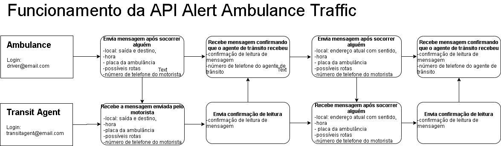

# Projeto Alert Ambulance in Traffic - Projeto Final Reprograma Luana Cristina

O objetivo dessa API é receber mensagens da localidade em que a ambulância está e para onde está indo e quando estiver em engarrafamento ou trânsito lento enviar mensagens informando a rua e sentido que está indo para os agentes de trânsito gerenciar o tráfego para a ambulância passar com facilidade e sem esperar muito tempo.
As mensagens serão trocadas entre o responsável pela ambulância (o motorista) e os agentes de trânsito.
O que motivou a realizar essa API foi depois de ter observado diversas vezes ao passar pelo trânsito lento pilotando a moto pelo corredor e verificar que a sirene da ambulância não dar para ouvir em certa distância e o agente de trânsito não escuta há tempo de agilizar a passagem dos carros da rua em que a ambulância está para que ela chegue ao seu destino com mais rapidez.
Negócio:
1. O acesso a API será realizada apenas por meio dos agentes cadastrados e autorizados pelo órgão responsável (CTTU) e os motoristas das ambulâncias cadastrados e autorizados pelas prefeituras;
2. Apenas os agentes de trânsito e motorista da ambulância cadastrados e autorizados poderão fazer o login na API;
3. Inicialmente todos os agentes que tem o smartphone adquiridos pela CTTU. E depois para os agentes de trânsitos que estiverem trabalhando no dia em que a ambulância estiver na rua com pacientes.
4. Inicialmente funcionará apenas para a cidade do Recife e sua região metropolitana.
5. As mensagens terão o nome do responsável, placa da ambulância, local de partida e destino. A mensagem deve ser enviada no momento que ambulância estiver saindo do local que estiver socorrendo ou tranferindo o paciente. E deve ser enviada outra mensagem se estiver em um trânsito lento ou parado. 

## Referências

* http://www2.recife.pe.gov.br/node/289274
* https://ieeexplore.ieee.org/abstract/document/7972255
* https://d1wqtxts1xzle7.cloudfront.net/34427407/IIJEC-2014-07-03-3.pdf?1407884826=&response-content-disposition=inline%3B+filename%3DIPASJ_International_Journal_of_Electroni.pdf&Expires=1607005524&Signature=IVPbB-nVg9sy1r-FljO9ao68e96bP2NgDPzT2~KMA1C0h0hU7YwIWCpVSP0n-V4MktpFSUTQazUGcJ2pvhIoGJhzv0HdGTG58u~IT4AhJuW~sMelqeZECORL~DR0rMIqnnF80697KDK6~Uxe6gwWN2LB2RvBkw4adfSgzQhiPumBxPgkSNOxnFhtbGlqxvdNrY2PVr1KTWCwHXV1PiYUGp371EjEkmWmxMwxbGCZzu2fiiK71EKDswp548hz~S8B4HgQ4QFG2QGDp8f5Qcm8XMDz-49QZtYdCPaAT6nEJhQZ0VlzX5GLdl-ftj45WUHkn4j7xPU0FHmDIfQThVc9sQ__&Key-Pair-Id=APKAJLOHF5GGSLRBV4ZA
* https://patents.google.com/patent/US8612131B2/en
* https://d1wqtxts1xzle7.cloudfront.net/39023780/42_Automatic.pdf?1444126631=&response-content-disposition=inline%3B+filename%3D42_Automatic.pdf&Expires=1607005536&Signature=Ug1-B2ozibKfsvwrGuAZ~0L6Tz~Et282sFUbdmsl7dnI4rEdKTMt9cMqjvEWZNZkSxfpCPE~ONcWoz2Mf8pVPkstzjUqe3j1uGMlWOU5KRNINtyjCSTrxs5SvTMqWn1P88lRnnZyTTV8fHt74wrOrkdqXszPTUlDBURJ6IKxtzBrlTgLKIMoU5wjPHmTZ1MP5k1AjrCSP3h1mu~Z82j9R0k0v4XP-9eRre2LViJ63kwhGpi~iIdpIIinS1SJyiMn9JQvE~uRPHqqy9Vl6MCxdC780uwcsvWhx1CrhI74qRPM5oGbAMjSWW8CkEPFCOw~rV4K4l4fuL3nRDFDEnjfLg__&Key-Pair-Id=APKAJLOHF5GGSLRBV4ZA
* http://citeseerx.ist.psu.edu/viewdoc/download?doi=10.1.1.675.3045&rep=rep1&type=pdf
* https://www.semanticscholar.org/paper/An-Approach-towards-Traffic-Management-System-using-Shaikh-Chandak/fb24269fb2ae1cc53dc22bdfea675d7e163c1264?p2df


## Diagrama do funcionamento da api



## Ferramentas, linguagens e tecnologias
* Node.js
* Git/GitHub
* NestJS
* PostgreSQL
* Bruno
* SWAGGER
* Railway

## Melhorias futuras
* Estruturar o código na arquitetura hexadecimal
* adicionar a api do google para definir a rota que será seguida.
* No POST/GET mensagens, agente de trânsito, motorista, coordenador.
* Adicionar segurança para que apenas os usuários com sessão validada tenha acesso aos dados que consta na API.
* Adicionar PACTH para atualizar os usuários e mensagens.
* Adicionar DELETE para excluir usuários e mensagens que não trabalham mais na área ou outro motivo que necessite excluir o usuário ou a mensagem.
* Adicionar GET para retornar apenas as mensagens por data atual e horário, por exemplo: data de hoje ou hora da manhã.
*  Estimativa: Aqui seria uma estimativa de acordo com o trânsito da rota escolhida para poder enviar para os agentes terem uma perspectiva de qual momento deve liberar o trânsito em caso de tráfego.
* Horários de picos: Conectar com aplicações que têm essas informações em tempo real ou pegar essas informações de um local que tenha essas informações.
* Semáforos: Pesquisa para saber se tem como manipular os semáforos para liberar quando o motorista estiver perto. Pode ser pelo aplicativo que vai reconhecendo a rota assim como ocorre no waze ou utilizando o próprio waze ou google api e aí vai ativando ou enviando uma mensagem para o responsável de manipular o semáforo para abrir na rota que a ambulância está passando e fechar os demais. 
* Pacientes: Informações sobre o paciente (alergias, triagem, tipo sanguíneo, etc) para o hospital se preparar ou saber se haverá vaga para ele lá.
* Hospitais v.1.2: Aqui vai ter informações sobre a especialidade do hospital para atendimento.
* Adicionar feedbacks para o usuário quando houver um erro ou quando demorar o retorno da aplicação.
* Adicionar as melhorias relacionado aos feedbacks da apresentação do projeto ou dos testes realizados.

## Canvas do projeto
[Apresentação](https://www.canva.com/design/DAGOyq7vdH4/2B9bTcc6UosOmtywNwI2-w/edit?utm_content=DAGOyq7vdH4&utm_campaign=designshare&utm_medium=link2&utm_source=sharebutton)

## Rotas
[SWAGGER](http://localhost:3002/api) 

## Description

[Nest](https://github.com/nestjs/nest) framework TypeScript starter repository.

## Installation

```bash
$ npm install
```

## Running the app

```bash
# development
$ npm run start

# watch mode
$ npm run start:dev

# production mode
$ npm run start:prod
```

## Test

```bash
# unit tests
$ npm run test

# e2e tests
$ npm run test:e2e

# test coverage
$ npm run test:cov
```
